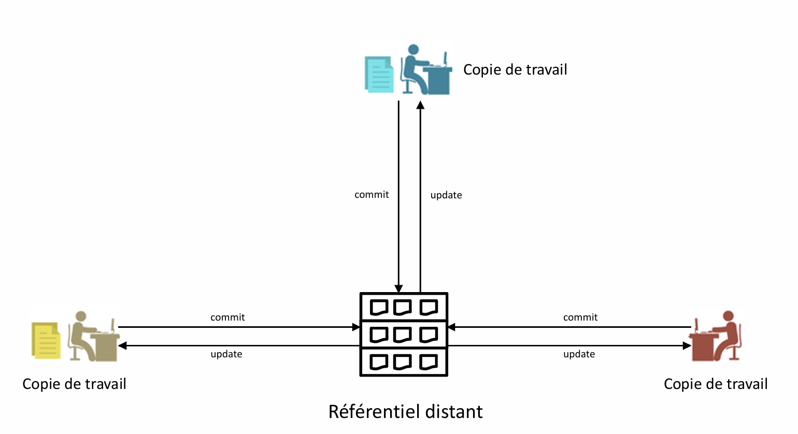
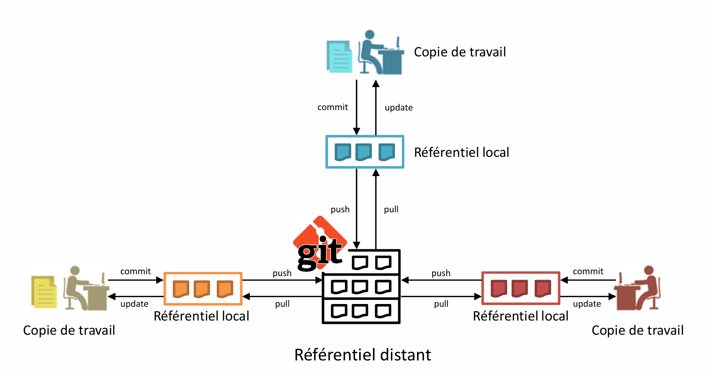
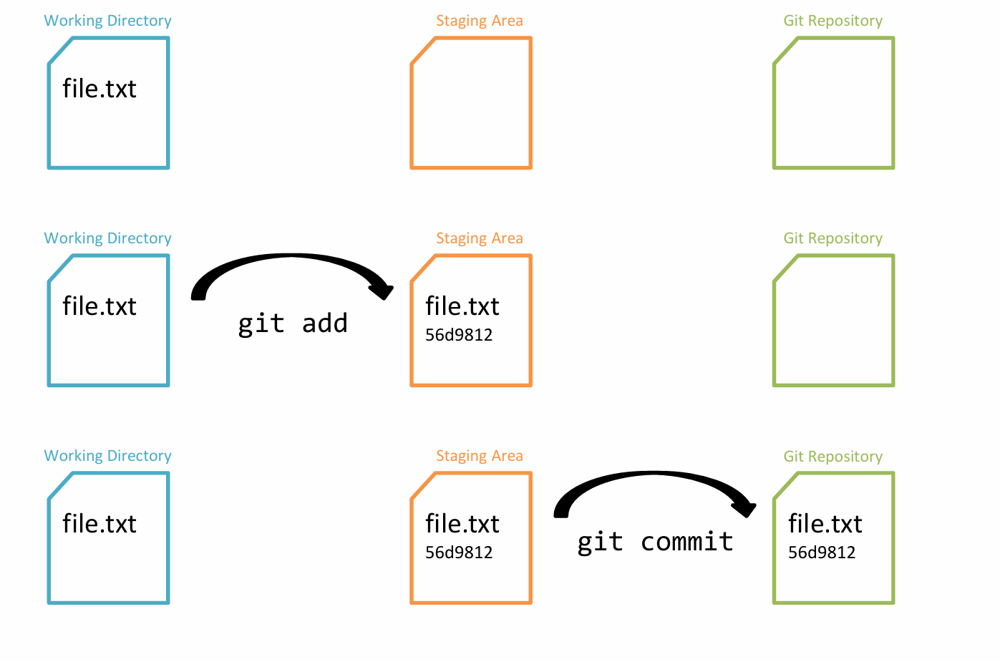

# Module 01 - Présentation et concepts
- La gestion du code source
- Le contrôle de version
- La gestion centralisée vs. décentralisée
- Comparatif des différentes solutions de gestion de versions : (Git, CVS,SVN,...)
- Présentation de Git
- Historique
- Concepts fondamentaux 

--------
## La gestion de versions
### Besoins
- Centraliser globalement le code de plusieurs projets/applications
- Pouvoir restaurer une version antérieure d’un fichier 
### Solution
- Les systèmes de gestion de version 
    - SCM : Source Code Management
### Rôles d’un SCM concernant la gestion des versions
- Ramener un fichier à un état précédent
- Visualiser les changements au cours du temps
- Voir qui a modifié quoi
- Déterminer quel changement a causé des problèmes
--------
## Les SCM
### CVS : Concurrent Versions System (1990)
 - Utilisation en ligne de commande principalement.
 - Serveur central historisant toutes les modifications de code dans chacun des fichiers.
 - Gestion des conflits limitées.
### Subversion (SVN) (2000)
 - Tentative d’amélioration de CVS.
 - Apache Software Foundation depuis 2010.
 - Serveur central historisant les modifications dans un fichier journal. Les 
performances sont donc meilleures.
 - Gestion des conflits optimisées.
### Git (2005)
- Initiative de Linus Torvalds pour gérer les sources du noyau Linux
- Licence GNU GPL v2
- Utilise un serveur central, mais le code est également stocké sur la machine de 
chaque développeur. Une synchronisation est donc nécessaire périodiquement
--------
## DVCS vs. CVCS
### CVCS 
- Centralized Version Control Systems
    - Systèmes de gestion de version centralisés
- CVS, Subversion, …
### DVCS
- Distributed Version Control Systems
    - Systèmes de gestion de version distribués
- Git, Mercurial, ...
--------
## Les systèmes centralisés (CVS, SVN)

--------

## Les systèmes distribués : Git

--------

## Avantages d’un système distribué
- L’historique des sources et des versions d’un projet est présent sur plusieurs 
machines.
    - Solution de secours en cas de crash du serveur.
- Il n’est pas nécessaire d’être connecté au réseau pour pouvoir utiliser la gestion de version.
- Permet de collaborer à un projet même sans avoir de permissions 
particulières au départ
    - Les droits peuvent être accordés plus tard !
- Les accès quotidiens sont locaux, donc plus rapides

--------

## Git

 ### Particularités
- Système décentralisé (DCVS)
    - Aucun serveur maître n’est nécessairement requis, un référentiel local peut suffire.
    - Chaque développeur a son dépôt autonome.
- Fichiers identifiés par un hash SHA-1
    - Aucun diff n’est stocké
    - Si un fichier est modifié, deux versions sont enregistrées
### Pourquoi Git ?
- Robustesse
- Architecture distribuée
- Conception simple
- Support de milliers de branches en parallèle
- Gestion efficace des projets d’envergure
  
 https://git-scm.com

 --------

 ## Comprendre le fonctionnement de Git

### Git ne stocke aucun diff
- Génération d’un instantané à chaque changement dans le projet
- Référence vers la version antérieure si un fichier n’est pas modifié
- Chaque fichier est différencié par une empreinte SHA-1
### Avantages
- Passage de version en version très rapide
- Gestion de l’intégrité grâce aux hash SHA-1
- Un nombre de possibilités accru

--------

## Vocabulaire

### Repository / Dépôt
- Contient l’ensemble de l’historique du projet. 
### Commit
- Collection de changements d’un ensemble de fichiers dans un dépôt.
- Un commit est identifié par un hash SHA-1
    - Exemple : **8578958fcc7323c05108e3190e9b52958f1577b3**
    - En pratique, on utilisera seulement les 7 premiers digits pour identifier un commit
        - Ici : **8578958**

--------
## Etats d’un fichier avec Git
### Les états d’un fichier sont représentés selon leur présence dans l’une des 3 zones suivantes : 
- Répertoire de travail (**Working Directory**)
    - Répertoire du système de fichiers sur lequel travaille le développeur.
    - Un fichier qui se trouve uniquement dans cette zone est un fichier totalement inconnu 
pour Git.
        - «Untracked file »
- Zone d’index (**Staging Area**)
    - Zone d’attente de commit indépendante du répertoire de travail.
    - On y place les différents fichiers qui devront être intégrés au prochain commit.
- Dépôt (**Git Repository**)
    - Les fichiers sont versionnés par Git qui en contient au moins une version.
    - Contient tous les commit et donc tout l’historique du projet.
--------

## Etats d’un fichier avec Git

--------
## Quelques ressources sur Git
- Git Book  
https://git-scm.com/book/fr/v2

- Tutoriels d’Atlassian (SourceTree, BitBucket, …)  
https://www.atlassian.com/git/tutorials

- Git cheatsheet  
http://ndpsoftware.com/git-cheatsheet.htm