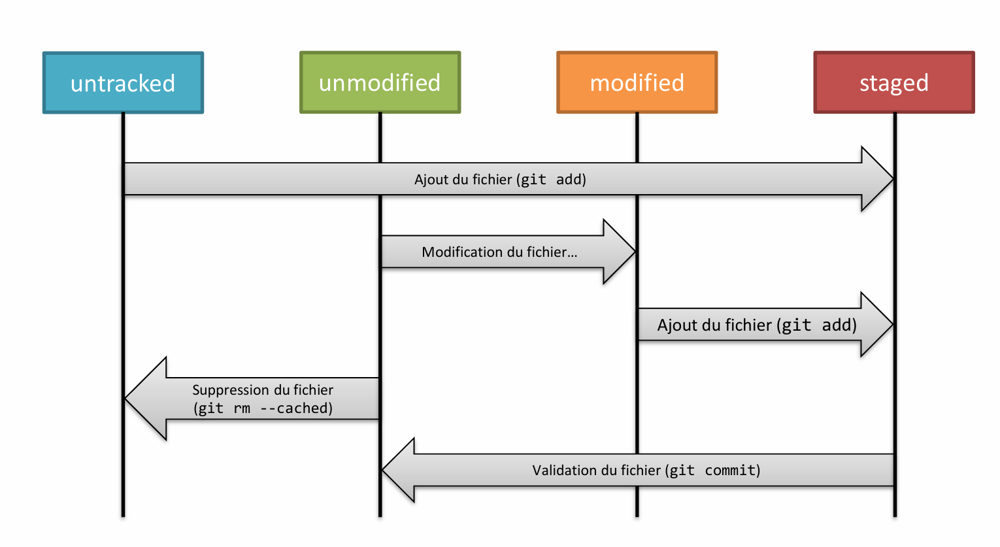
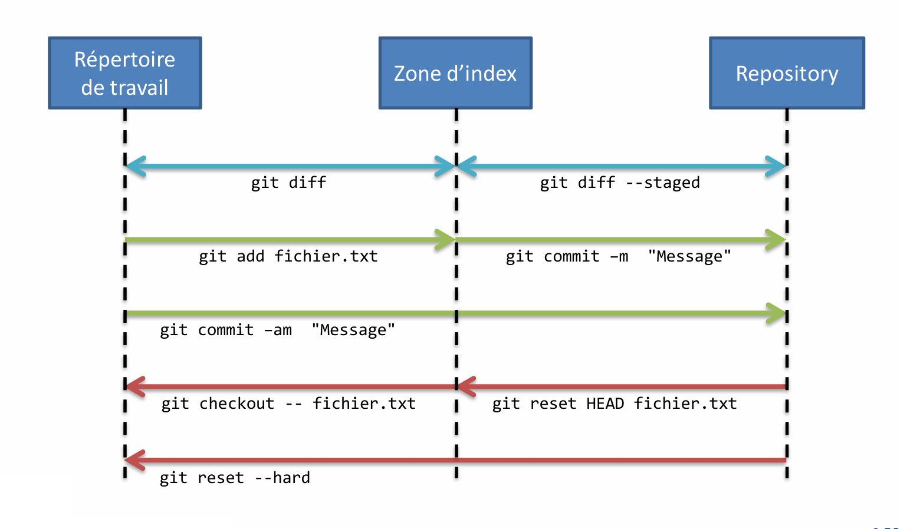

# Module 03 - Les bases de Git
- Le dépôt
    - Création d'un dépôt local.
- Travailler avec le dépôt
    - Publier des fichiers.
    - Enregistrer des modifications.
    - Visualiser l'historique.
    - Annuler des actions.

# Dossier de travail vs. Dépôt Git
- Le dossier de travail :
    - Il contient les fichiers du projet.
    - Il peut exister avant une prise en charge par Git.
    - Il est local sur le poste de travail du développeur.
- Le dépôt Git :
    - Il contient tout l'historique du projet, toutes les modifications, toutes les 
révisions…
    - C'est le dossier .git du dossier de travail 

# Le dépôt Git
- Un dépôt Git est un répertoire contenant l'historique d'un projet logiciel.
- Un dépôt local :
    - Est situé sur la machine du développeur ;
    - N'est pas partagé entre plusieurs développeurs.
- Pour créer un dépôt, il faut initialiser un répertoire avec la structure 
nécessaire.
- Deux cas de figure : 
- Le répertoire existe déjà (et contient peut être des fichiers de projet !) :
    - Se positionner dans le répertoire 
    ```
    git init
    ```
    - Le répertoire n'existe pas :
    ```
    git init <nom_répertoire>
    ```

# Ajout de fichiers au dépôt
- Pour qu'un fichier passe sous contrôle de version Git, il faut d'abord l'ajouter 
au dépôt.
- Commande git add
    - Elle va ajouter le(s) fichiers dans la zone d'index, ils sont simplement marqués et ne 
sont pas encore ajoutés !
- Ajouter un fichier :
```
git add test.js
```
- Ajouter tous les fichiers du répertoire :
```
git add .
```
- Ajouter de manière interactive :
```
git add -p
```
- A tout moment, la commande git status permet de connaître l'état du dépôt Git ! 

# Valider des fichiers dans le dépôt
- Valider les fichiers dans le dépôt consiste à envoyer les fichiers présents dans la 
zone d'index dans le dépôt.
    - C'est le « commit » !
    - Chaque commit concerne une collection de modifications apportées à un ou 
plusieurs fichiers.
- Pour le bon suivi de l'historique du projet, chaque commit doit être associé à un 
message décrivant les modifications qui sont apportées au projet par cette 
validation.
- Validation avec ouverture de l'éditeur de texte pour la saisie du message : 

```
git commit
```

- Validation avec message : 

```
git commit -m "Mon commentaire constructif"
```

- Indexation et commit en une seule commande ! : 
  
```
git commit -am "Mon commentaire constructif"
```
  
- Cela permet d'enregistrer toutes les modifications en cours, même celles non-indexées ! 
- ATTENTION : Cela ne s'applique qu'aux fichiers déjà existant dans le dépôt
 
# git commit : Bonnes pratiques

- Bonne pratique de « commit » Git :
    - Ne concerne qu'une seule fonctionnalité du projet **feature** ou **refactoring** ;
    - Est le plus petit possible tout en restant cohérent ;
    - Idéalement, compile seul.
- Un commit n'est pas, contrairement aux idées reçues, une liste 
d'ajout/suppression/modification de lignes !
    - Git sauvegarde chaque fichier entièrement à chaque changement.
        - Avec des métadonnées (commentaire, auteur, email, date, …)

# Etats de fichiers
- La commande git status permet de lister les modifications en cours du 
dossier de travail et de la zone d'index.
- En gros, les fichiers non enregistrés dans le dépôt.
- Quatre états possibles :
- **untracked**
    - Non suivi, le fichier est inconnu de Git !
- **unmodified**
    - Le fichier n'a pas été modifié depuis son dernier ajout au dépôt.
- **modified**
    - Il y a des différences entre le fichier du répertoire de travail et celui du dépôt.
- **staged**
    - Le fichier est dans la zone d'index, il sera ajouté au prochain commit.

# Cycle de vie des états de fichiers




# Exemple : git status
imprime ecran

# Gestion des modifications de fichiers

Lorsque des fichiers sont modifiés, ils doivent être de nouveau ajoutés à la 
zone d'index avant d'être validés dans le dépôt.
- Les commandes suivantes sont donc nécessaires : 
```
git add .
```
```
git commit -m "message ici"
```
- Ces deux commandes peuvent être synthétisées en une seule (car le fichier 
existe déjà dans le dépôt) : 
    - git commit -am "..."
- A noter que la commande git commit -a ajoutera à la zone d'index et 
validera dans le dépôt l'ensemble des fichiers modifiés du répertoire de 
travail 

# L'historique d'un dépôt Git
- L'historique d'un dépôt Git contient toute « l'histoire » d'un projet et de ses 
fichiers, tout est toujours conservé !
- Dans certaines situations, il est nécessaire d'interagir avec l'historique pour le 
visualiser mais aussi parfois de le modifier.
- Pourquoi modifier l'historique ?
    - Un fichier a été oublié lors d'un commit ;
    - Un bug subsiste ou bien un nouveau bug a été introduit lors d'un commit et 
on ne veut pas revenir à des états de bugs dans l'historique ;
    - Les commit ne sont pas suffisamment fin car ils concernent plusieurs 
fonctionnalités à la fois.
- Limites de la modification de l'historique :
    - Ne modifiez jamais l'historique d'un dépôt ayant été partagé sur un dépôt 
centralisé ! Vous impacterez tout le monde 

# Les révisions
- Chaque commit sur un dépôt créé une nouvelle révision de chaque fichier 
modifié.
- Chaque commit correspond en fait à un ensemble de révision, et donc de 
changements, qui ont été validés.

# Visualiser l'historique
- La visualisation de l'historique permet de naviguer dans les changements du 
projet et d'identifier les numéros (hash SHA-1) des commits pour intervenir 
sur ceux-ci.
```
git log
```

- Cette commande dispose de nombreuses options pour personnaliser 
l'affichage de l'historique.
```
git log --pretty=format:"%h - %an : %s"
```
```
git log --oneline
```
```
git log --graph
```
```
git log --decorate
```

- Ces options sont cumulables !
```
git log --oneline--graph --decorate
```
# Les fichiers dans l'historique
- La commande git log permet d'identifier chaque commit dans l'historique.
- La commande git show permet de connaitre la liste des fichiers modifiés 
par un commit.
    - Syntaxe : 
    ```
    git show <numéro de commit.>
    ```
    **Affiche toutes les métadonnées, le nom et le contenu du fichier.**
    ```
    git show --name-only <numéro de commit.>
    ```
    **Permet un affichage plus concis.**

# Les fichiers dans l'historique (suite)
- A l'inverse de la commande git show, il est également possible de lister les 
commit ayant impactés un fichier particulier.
```
git log -- <nom du fichier>
```

# Visualiser les différences dans l'historique

- Les différences entre le répertoire de travail et la zone d'index
```
git diff
```
- Les différences entre la zone d'index et le dernier commit
```
git diff--cached
```
- Les différences entre le répertoire de travail et le dernier commit
```
git diff HEAD
```
- Les différences mot à mot
```
git diff--word-diff
```
- Les différences lettre à lettre
```
git diff--color-words=.
```
- Les différences entre le dernier commit et l'avant dernier
```
git diff HEAD^ HEAD
```

# Supprimer des changements
- Checkout
    ```
    git checkout <fichier/branche/commit>
    ```
    - Récupérer la dernière version (depuis le dépôt) : un fichier / un commit / une branche
- Il est possible d'indiquer un numéro de révision pour restaurer le fichier à une 
version antérieure : 
    ```
    git checkout <numero> -- <fichier/branche/commit>
    ```
- Reset
    - Suppression effective !
- Exemple : Annuler les 2 derniers commits
    ```
    git reset --soft HEAD~2
    ```
    - Les modifications sont laissées dans l'index.
    ```
    git reset --mixed HEAD~2
    ```
    - Les modifications sont supprimées de l'index mais sont conservées dans le répertoire de 
travail (comportement par défaut).
    ```
    git reset --hard HEAD~2
    ```
    - Les modifications sont supprimées de l'index ET du répertoire de travail

# Les commandes de l'historique


# Ignorer des fichiers

Il est possible d’exclure des fichiers du contrôle de version Git.
    - Fichiers de préférences d’IDE, résultats de build,…
- Ajouter un fichier <code>.gitignore</code> à la racine du projet.
    - Ce fichier contient des motifs de spécification de fichiers/répertoires.
    - Règles : 
        - Les lignes vides ou commençant par # sont ignorées.
        - Les motifs d’expression des shells sont utilisables (caractères joker).
        - Les motifs se terminant par un / indiquent des répertoires.
        - Les motifs commençant par ! indiquent des éléments à inclure malgré les autres 
motifs précédents.
- Supprimer du dépôt un fichier ignoré après un push : 
```
git rm--cached /build-r
```

# Exemple de fichier .gitignore
fichier <code>.gitignore</code>
```
# pas de fichier .a
*.a

# mais suivre lib.a malgré la règle précédent
!lib.a

# ignorer uniquement le fichier TODO à la racine du projet
/TODO

# ignorer tous les fichier dans le répertoire build
build/

# ignorer doc/notes.txt, mais pas doc/server/arch.txt
doc/*.txt

# ignorer tous les fichiers .txt sous le répertoire doc/
doc/**/*.txt

```

# Supprimer des fichiers non versionnés

 - Vérifier les fichiers qui seront supprimés
````
git clean -n
````
- Supprimer les fichiers
````
git clean -f
````
- Supprimer fichiers et dossiers
````
git clean -df
````
- Supprimer des fichiers et dossiers y compris ceux listés dans .gitignore
````
git clean -xdf
````
- Supprimer seulement des fichiers dans .gitignore
````
git clean -Xf
````

# Autres commandes utiles…
- Renommer ou déplacer un fichier.
```
git mv <source> <destination>
```
- Supprimer un fichier du répertoire de travail et de la zone d’index.
    ```
    git rm <fichier>
    ```
    - L’option --cached permet de le supprimer uniquement de la zone d’index (Il devient 
« untracked »).

- Ces commandes nécessitent un commit pour que les modifications soient 
prises en compte dans le dépôt.