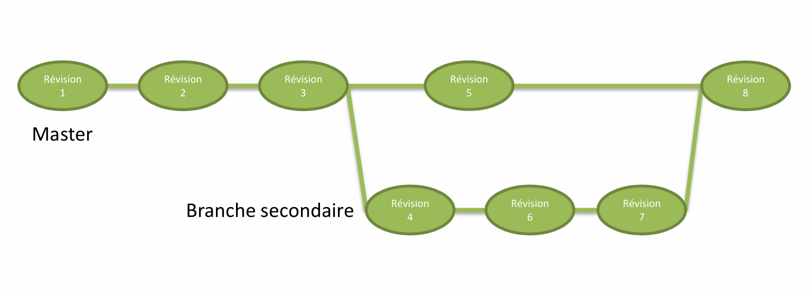
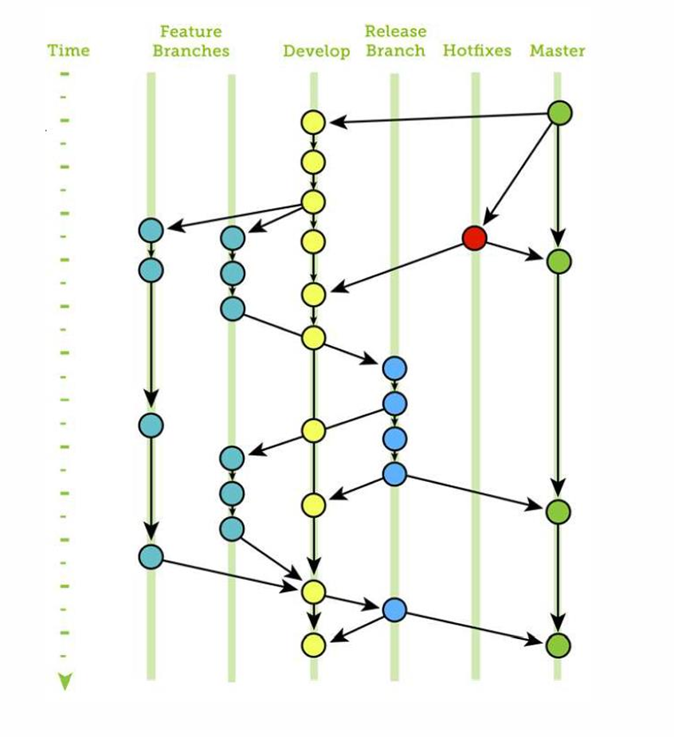
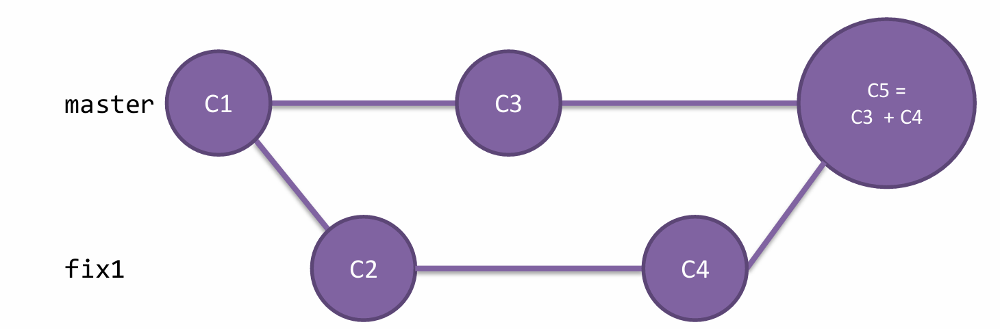
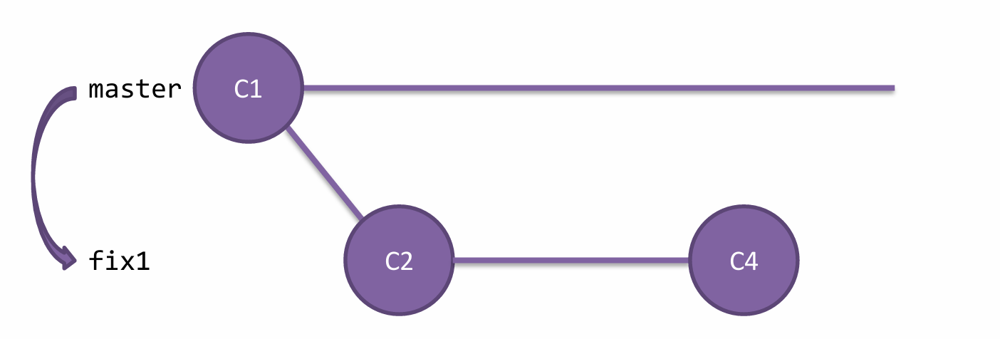
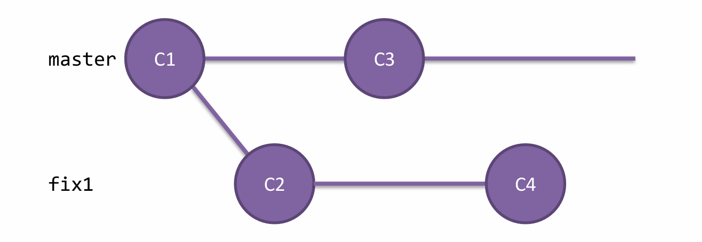
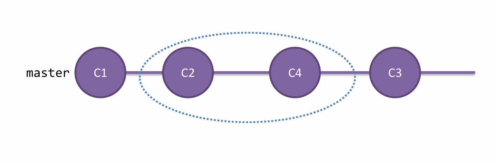

# Module 05 Une branche
- Qu'est-ce qu'une branche ?
    - Principes et organisation
    - La branche « master »
    - Bonnes pratiques d'utilisation des branches
- Gestion des branches
    - Travailler avec les branches
    - Créer et fusionner des branches

## Qu'est-ce qu'une branche ?
Une branche est un simple pointeur vers un commit particulier.
- Tout dépôt Git contient une branche principale : master.
- La branche courante est nommée HEAD.
    - C'est un pointeur !
- Utilité : 
    - Idée : Une fonctionnalité par branche.
    - Exemple : 
        - Branche de développement (Dev), de maintenance, d'évolutions de fonctionnalités,...

## Organisation des branches
- Les branches permettent de travailler sur une copie de l'historique sans 
risquer de modifier un code déjà testé et validé.
- Les modifications pourront être ensuite reportées sur une autre branche.
    -Notion de « merge »


# Exemple d’organisation


## La branche MASTER /MAIN
:warning: La branche master est remplacé par **main**

- La branche main n'est pas, d'un point de vue technique, une branche 
spéciale. 
    - Elle est identique à toutes les autres branches ! 
- Chaque dépôt en a une car elle est créée par la commande git init.
    - Elle pourrait être renommée…
- Mais conventionnellement :
    - C'est **LA** branche de collaboration 


# Bonnes pratiques d'utilisation des branches
- Pour chaque projet, il est important de définir : 
    - Le rôle de chaque branche.
    - Une nomenclature de nommage.
    - Des responsabilités de gestion de branches.
    - Le périmètre de chacune des branches.
- On ne devrait jamais faire de modifications directement sur la branche 
MASTER !
- C'est la branche ou les développeurs viendront ajouter leur travail issu 
d'autres branches.
- Elle sert de branche de collaboration

# Travailler avec les branches
- Les commandes <code>git branch</code> et <code>git checkout</code> permettent de travailler avec les 
branches.
- Lister les branches existantes :
```
git branch
```
    - La branche courante est indiquée avec *
- Créer une branche :
```
git branch <nom de la branche>
```
- Changer de branche : 
```
git checkout <nom de la branche>
```
- Créer une branche et se positionner dessus : 
```
git checkout–b <nom de la branche>
```
- Renommer la branche courante : 
```
git branch–m <nouveau nom>
```
- Renommer une branche :
```
git branch–m <ancien nom> <nouveau nom>
```

# Changer de branche
- Pourquoi ?
    - Corriger un bug prioritaire sur sa tâche actuelle,
    - Continuer à travailler sur une nouvelle fonctionnalité (donc sur une autre branche),
    - Fusionner deux branches pour mettre à jour la version de développement avec une 
nouvelle fonctionnalité par exemple.
- Effets du changement de branche
    - Le répertoire de travail est modifié.
    - L'index reste intact.
    - La référence HEAD est mise à jour et correspond au commit le plus récent de la 
branche sur laquelle le développeur s'est placé. Le prochain commit aura pour 
commit parent le nouveau HEAD et sera donc considéré comme un commit de la 
branche sur laquelle le développeur s'est placé.
- Avant de changer de branche, il faut veiller à n'avoir aucune modification en cours 
dans le répertoire de travail et dans l'index ! 
    - Il est possible de vérifier les modifications en attente avec la commande git 
status.

# Mettre des modifications de côté
- Au moment du changement de branche, aucune modification non 
enregistrée dans le dépôt ne doit exister.
- Deux possibilités : 
    - Les valider dans le dépôt : commit
    - Les mettre de coté pour y revenir plus tard : stash
- La commande git stash permet de gérer les modifications en attente

# La commande git stash
stach stach ;)

Elle permet de gérer des modifications en attente/de côté sans qu'elles 
apparaissent dans l'historique.
- Voir les changements mis de côté :
```
git stash list
```

- Mettre une modification de côté :
```
git stash push 
```
- Récupérer la dernière modification de côté sauvegardé : 
```
git stash pop
```
- Récupérer une modification de côté avec son nom et numéro (donné par stash
 list) : 
```
git stash pop <nom de stash>
```
- Exemple :
``` 
git stash pop stash@{1}
```
- Supprimer une modification de côté : 
```
git stash drop <nom de stash>
```

# Fusionner des branches

- Intégrer les modifications d'une branche dans une autre.
    - «merge»
- Se poser la question : dans quelle branche dois-je intégrer les modifications de l'autre branche ?
- Avant de fusionner : 
    - Ne pas avoir de modifications en cours ! (Tous les commits ont été faits.)
- Exemple :
    - On souhaite intégrer les modifications de la branche fix1 dans la branche master.
        -Se positionner sur la branche cible (master)
        ```
        git checkout master
        ```

        -Fusionner la branche fix1 dans master
        ```
        git merge fix1
        ```

# Ce que fait la fusion…
- Recherche du dernier commit que les deux branches ont en commun.
    - « ancêtre commun »
- Création d'un nouveau commit 
- Y apporter les modifications de la branche fusionné. 
    - Ce commit est particulier car il hérite de deux parents : commit de « merge ». 
    - Ces étapes sont totalement transparentes pour le développeur

# Exemple : commit de « merge »



- Création d'une branche nommée fix1 à partir du commit C1 de la branche master. 
    - C2 est le premier commit de fix1. 
    - La vie de la branche principale (master) continue (commit C3).
- C4 représente le deuxième et dernier commit de fix1. 
    - C'est le commit pointé par la référence fix1.
- C5 représente le commit de merge. 
- C'est le commit qui va réunir les modifications de fix1 pour les intégrer dans la branche 
master

# L'avance rapide
- L'avance rapide est un système interne à Git qui lui permet de gagner en 
performances lorsque la branche cible de la fusion n'a pas subit de 
modification depuis la création de la branche à fusionner.
- Dans ce cas, aucun commit de « merge » n'est créé.
    - Le pointeur de la branche master est déplacé sur C4


# Supprimer une branche
- Cas qui nécessitent la suppression d’une branche :
    - La branche a été fusionnée dans master et aucune autre modification n’est 
prévue dans cette branche.
    - Les modifications dans cette branche ne sont plus à l’ordre du jour et elles ne 
seront jamais intégrées. 
- Attention, il ne faut supprimer une branche que lorsqu’on est sûr et certain 
que les modifications qu’elle apporte n’ont et n’auront plus aucune valeur.
- Commande :
``` 
git branch–d <nom de branche>
``` 

# « Rebaser »
- Une approche pour intégrer les modifications d’une branche dans une autre !
    - Cela correspond à une réécriture d’historique !
- Au lieu d’intégrer toutes les modifications d’une branche dans un unique 
commit, il est possible de modifier la base d’une branche en incluant les 
commits d’une autre branche.
- Situation avant le rebase :



# git rebase
- Opérations pour rebaser : 
    - git checkout master
    - git rebase fix1
- Situation après le rebase :

  
# Les conflits de fusion

- S’il y a eu des changements apportés aux 2 branches sur les mêmes lignes, il 
sera alors impossible de réaliser la fusion sans corriger le conflit au préalable.
- Corriger le(s) fichier(s) en conflit.
- Penser à retirer les lignes <<<<, ==== et >>>>
- Une fois le conflit résolu, utiliser la commande git add.
- Terminer la fusion avec un git commit