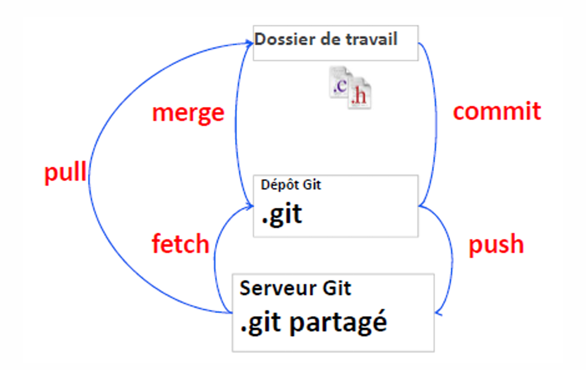

# Module 06 - Git et les dépôts centralisés

-Qu’est ce qu’un dépôt distant ?
    - Usage
    - Dépôt distant vs. dépôt local
- Les protocoles d’échange.
- Cloner un dépôt distant.
- Fonctionnement interne et branches distantes.
- Ajouter un dépôt distant.
- Envoyer des modifications.
- Recevoir des modifications.

## Qu’est ce qu’un dépôt distant ?

- Un dépôt distant est un dépôt qui va servir à centraliser un dépôt. 
- C’est un type de dépôt qui devient réellement indispensable 
lorsqu’on travaille à plusieurs sur le même projet.
    - Il permet de centraliser le travail de chaque développeur.
    - En anglais, ce type de dépôt s’appelle un _bare repository_ ou encore _un remote repository_.

## Dépôt distant : Scénario d’usage

### Mise en place : 
- Un développeur, Robert, crée un dépôt local et travaille dessus pendant plusieurs 
semaines.
- Un autre développeur, Stéphane, va venir travailler sur le projet. 
    - Robert va donc créer un dépôt distant pour que Stéphane et lui puissent partager leur travail.
- Robert continue à travailler seul en attendant l’arrivée de Stéphane. Il décide 
cependant de partager systématiquement son travail avec le dépôt distant.
- Stéphane arrive et clone le dépôt distant sur son poste.
- Stéphane et Robert travaillent donc ensemble en se partageant systématiquement 
leur code.
### Utilisation : 
- Robert va commencer à corriger un nouveau bug. Pour cela, il modifie un fichier, le 
teste et commite sa modification. Il veut ensuite partager ses modifications, il va 
donc utiliser la commande git push pour envoyer ses modifications.
- Le dépôt distant va recevoir et intégrer les modifications.
- Lorsque Stéphane utilisera la commande git pull, le dépôt distant lui enverra le 
commit publié par Robert

# Le cycle Git : Synthèse des commandes
-  Il y a toujours un dépôt local

# Les protocoles d’échange
- Quatre protocoles pour l’échange entre les dépôts :
    - Local
        - Utilise le système de fichiers.
    - SSH
        - Utilise SSH sur la machine contenant le dépôt distant.
    - HTTP
        - Utilise le protocole HTTP (nécessite un serveur HTTP).
    - Git
        - Utilise le protocole Git (performant).
- Exemples : 
    - git clone ssh://git.entreprise@serveur_ssh:CMS.git
    - git clone http://git-conflict.com/depots/CMS.git
    - git clone git://git-conflict.com/depots/CMS.git
- NOTE : L’URL utilise le nom du dépôt suivi de .git 
    - Cela fait référence au répertoire contenant le dépôt !

# Cloner un dépôt distant
- Un dépôt distant existe…
- Le clonage permet d’en avoir une copie sous forme d’un dépôt local.
- Exemple : 
o git clone https://github.com/seven-valley/formation-git-et-github.git
- Le dossier de travail est par défaut positionné sur la dernière révision du 
dépôt.
- On peut limiter le nombre de commit à récupérer au moment du clonage.
- git clone --depth 10 https://github.com/seven-valley/formation-git-et-github.git

# Fonctionnement interne et branches distantes
- Les dépôts distants sont des copies contenant tout l’historique des 
modifications.
    - Il faut les synchroniser avec les dépôts locaux.
- Un dépôt local peut être lié à plusieurs dépôts distants.
    - Un dépôt stable et un dépôt de développement par exemple.
        - Cela peut être une alternatives aux branches…
- La commande git remote permet de manipuler les dépôts distants associés 
aux dépôts locaux.
    - Sans arguments, la commande affiche les noms des dépôts distants.

# Ajouter un dépôt distant pour un dépôt local
- Un dépôt local existe déjà et un dépôt distant à été créé pour recevoir le 
contenu du dépôt local.
    - Une synchronisation doit être mise en place.
    - Il faut ajouter le dépôt distant au dépôt local (origin).
- Commande git remote.
- Ajout du dépôt distant :
    - git remote add <nom dépôt> <url>
        - Exemple : git remote add origin https://github.com/user/depot.git
- Visualiser les dépôts distants 
    - git remote–v
- Supprimer un dépôt distant : 
    - git remote remove <nom dépôt>
- Il faudra ensuite pousser des modifications avec git push 

# Envoyer des modifications
- La commande git push permet de pousser les modifications du dépôt local 
vers le dépôt distant.
    - git push <nom dépôt distant> <branche>
    - Exemple :
        - git push origin master
- On peut définir une branche distante par défaut.
    - git push –u <nom dépôt distant> <branche>
- Dans ce cas, un simple git push envoi vers cette branche.
- Si des modifications ont été validées sur le dépôt distant depuis la dernière 
récupération, git push génère une erreur.
    - Il faut alors synchroniser la branche au préalable avec git pull.

# Recevoir des modifications
- Récupérer les sources d’une branche distante.
    - git pull <nom du dépôt> <nom branche>
    - Exemple : 
        -git pull origin master
    - S’il s’agit de la branche par défaut (upstream) :
        - git pull
- Deux opérations sont réalisées : 
    - git fetch
        -Pour récupérer les sources sur une nouvelle branche locale.
    - git merge
        -Pour intégrer cette nouvelle branche dans la branche courante.
- On peut préférer un « rebase »…
    - git pull --rebase=preserve 

# Autres opérations distantes 
- Envoyer les tags au serveur distant : 
    - git push <nom de dépôt> --tags
- Effacer une branche distante : 
    - git push <nom de dépôt> --delete <nom de branche>

# Synthèse

