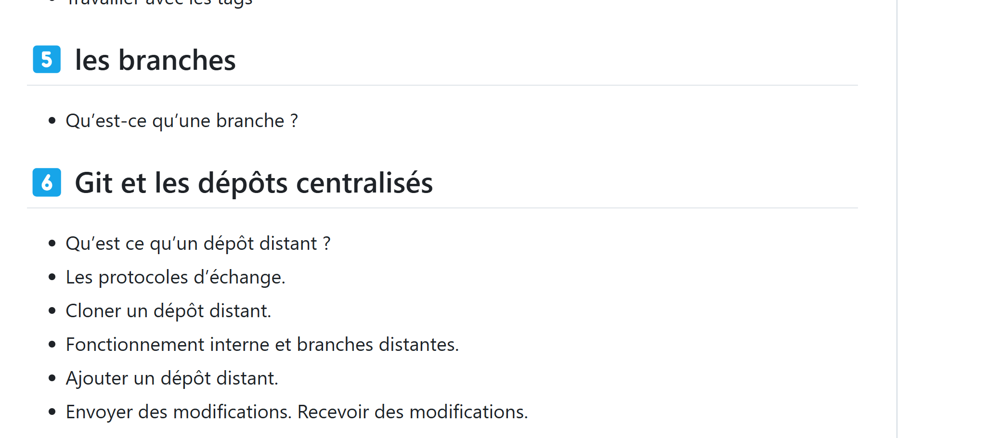

# titre du fichier README
Lien vers la documentaion
https://seven-valley.github.io/formation-git/
  
  
<a href="https://seven-valley.github.io/formation-git/">Lien vers la doc</a>


# Utiliser EMMET
File> Preferences > Settings

# plugins
- Live server

- Prettier

- turbo console

# commande terminal
afficher la liste des fichiers et répertoires
```
dir
```

Allez sur un répertoire
```
cd img
```

Remontez d' un répertoire
```
cd ..
```

Allez sur c:
```
cd\
```

vider le terminal
```
cd\
```